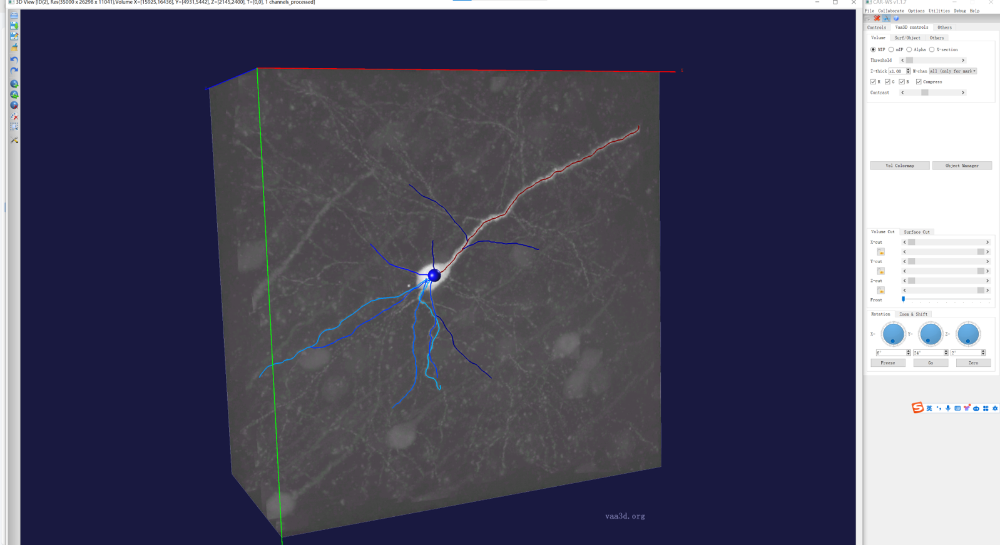
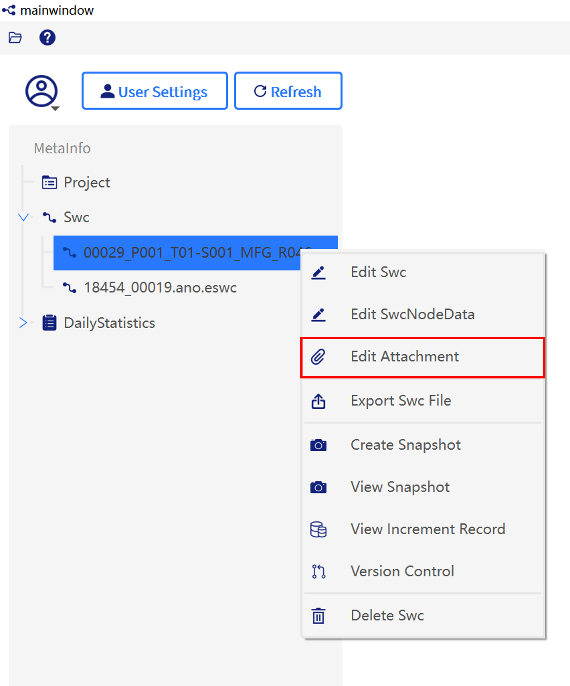
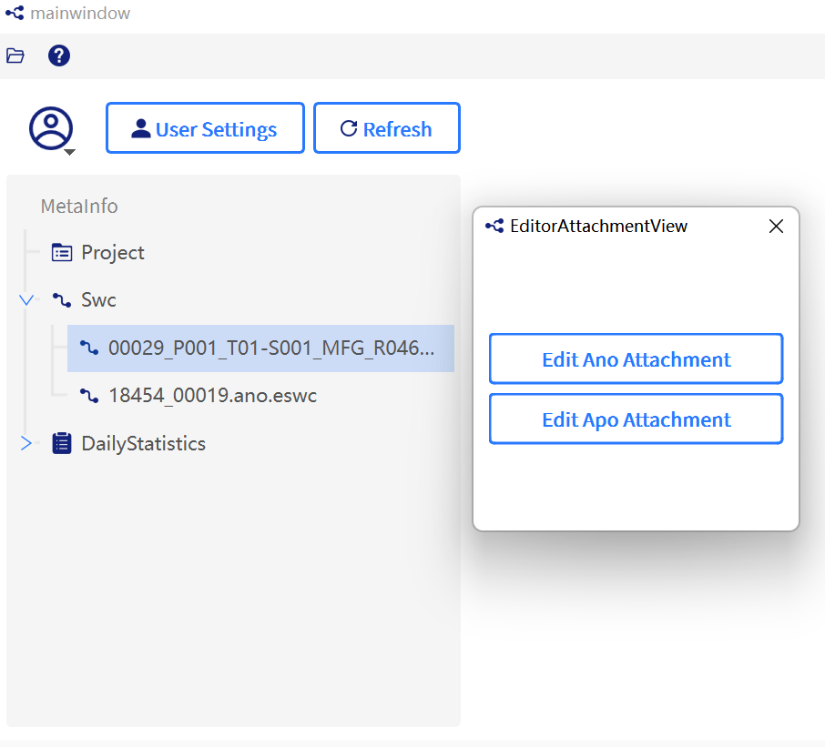
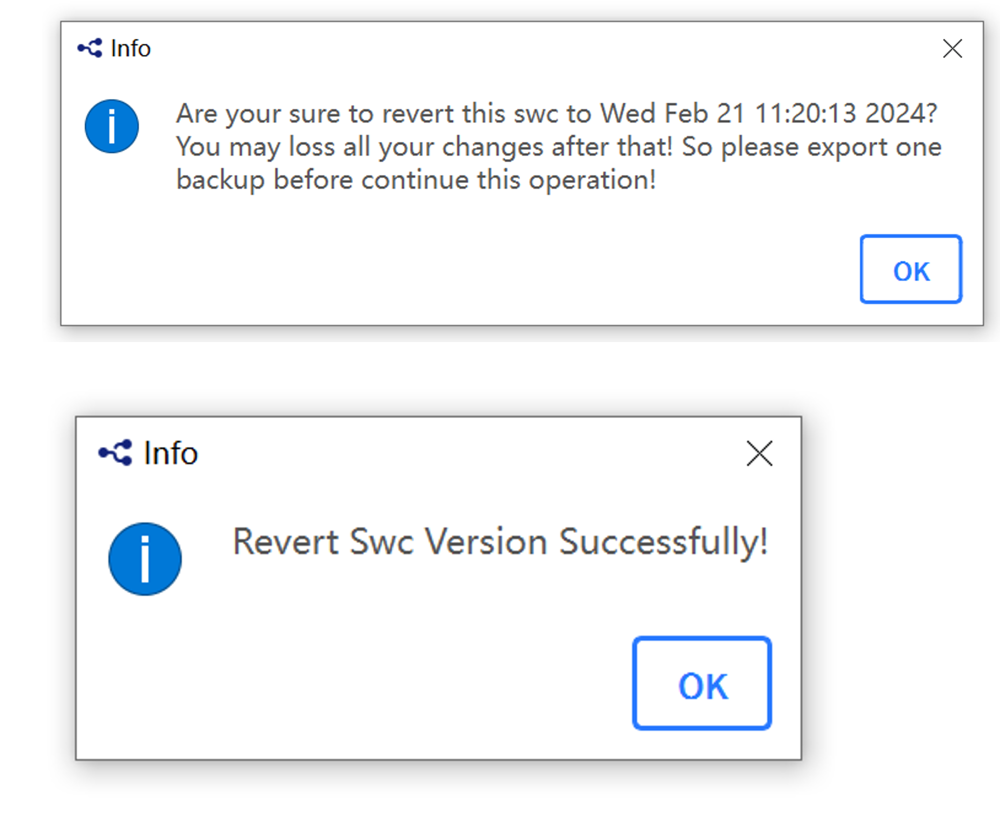

# CAR-WS

CAR-WS is built upon the Vaa3D system, incorporating a cloud server and enabling collaborative capabilities. It also incorporates several features from [Vaa3D](http://github.com/Vaa3D/).

# Installation

The workstation client and the VR client share the same software. For Windows system user, please download and unzip the releases and click on `vaa3d_CAR.exe` to run the software. The whole installation will cost 1-2 minutes.  If you would like to build the system from the source code, you are encouraged to contact the developers directly as the entire system involves a lot of components and potential optimization of the software-building configuration.

# Configuration and authorization

> [!TIP]
>
> Suitable data should consist of image files, such as those in TIFF format. For demonstration purposes, [test data](../assets/demo_image_data) is available for use.
> 
> If you are using our test server, we have provided two available test users. The usernames and passwords are as follows:
> 
> - Username: `testuser`, password: `123456`
> - Username: `testuser02`, password: `123456`
> 
> Additionally, we have already created two annotation files (two collaboration rooms), don't worry, you will encounter them in the upcoming tutorial.
> - A human brain neuron: `00029_P001_T01-S001_MFG_R0460_WY-20220415_GYC_03`.
> - A mouse brain neuron: `18454-00019`.

1. Click `Advanced` - `Big-Image-Data` - `CAR-WS` to open the panel.
2. Configuration before using.
    1. Click `Collaborate` - `Config`.
    2. A dialog will appear prompting for a username and password. Log in to CAR by entering the username and password.

Screenshots for configuration and authorization

**Figure 1**. The entry for CAR-WS.

**Figure 2**. The interface for config CAR-WS.

**Figure 3**. The interface for authenticating CAR-WS.

# Annotation 

### Open image and load annotations

1. Click `File` - `Open TeraFly Image(3-5D)` and choose an terafly format image.
2. Click `Collaborate` - `Load Reconstruction From Server` and then choose an annotation file (usually containing soma coordinates).
3. Choose any of them and click on `LoadAno` to enter collaboration mode.
4. A message window will pop up stating "Connect success! Ready to start collaborating". Click `OK` you can collaborate with others. Users can collaborate in one room each other by choose the same annotation file.

Screenshots for opening image and loading annotations

**Figure 4**. The entry for loading annotations.

    
**Figure 5**. The interface for loading annotations.

### Basic operations in manually annotation in CAR

During the annotation process, you can understand the current resolution of the image by viewing the "Resolution" option on the panel while toggling the resolution with a double-click of the mouse or scrolling the mouse wheel upwards.

If other signals interfere significantly with this neuron signal, you can reduce interference by adjusting the scroll bars for X-cut / Y-cut / Z-cut under the "Volume Cut" option to hide portions of the image block along the X/Y/Z directions in the coordinate system.

This makes it easier to determine the correct direction of the signal. Additionally, the scroll bars for X/Y/Z directions under the "Surface Cut" option can hide or display annotated line segments in the corresponding directions, also helping to reduce interference. 

When encountering situations where the neuron signal is intertwined with other signals and it is difficult to determine, you can adjust the "Z-thick" option to stretch along the Z-axis direction. If using the above options still makes it difficult to determine the correct direction of the neuron

During the annotation process, simply move the cursor to the desired location and press the `Q` key to quickly place a marker there.

Several shortcuts are provided to facilitate annotation:

| Shortcut          | Action                                                                |
| ----------------- | --------------------------------------------------------------------- |
| `Q`               | Define a marker.                                                      |
| `S`               | Toggle show/hide the line segment                                     |
| `Alt`-`B`         | **B**Boxes Mode: Draw curves using serial bounding boxes.             |
| `Alt`-`C`         | **C**onnection Mode: Connect multiple neuron segments.                |
| `Alt`-`D`         | **D**eleting Mode: Delete multiple neuron segments.                   |
| `Alt`-`S`         | **S**plitting/breaking Mode: Split or break multiple neuron segments. |
| `Alt`-`T`         | **T**yping Mode: Change types for multiple neuron segments.           |
| `Shift`-`Alt`-`T` | Color Setting Mode: Set the color of neuron segments.                 |

### Auto reconstruction in CAR

1. Open image and entering the corresponding collaboration room.
2. Switch image resolution.
    - Double-click to toggle between different image resolutions or right-click on a marker and select `Zoom-in to this selected marker location` to enter the highest resolution image.
    - The mouse scroll wheel can also be used to zoom in or out to different image resolutions.
3. Right-click on an image block that contains a marker to activate the automatic tracking algorithm. A menu with options will then appear.
4. Click the `app2Convenient` button to initiate the tracking process. The results will appear in a few minutes, please be patient.

Screenshots for auto reconstruction

**Figure 6**. The entry for auto reconsturction, example in mouse brain "18454-00019".

    
**Figure 7**. The results for auto reconsturction, example in mouse brain "18454-00019".

# Data Management

### Upload annotated files

1. Click `Collaborate` - `Data Management Client` and invoke the data management system.
2. Log into the data management system.
3. Upload your annotated files.
    1. Select the `Swc` option from column, right-click  on the interface, and click on the `Import Swc File` button.
    2. In the pop-up window, you can choose `Select Import Files` to upload single files, or choose `Select Import Folder` to upload files in bulk, and then click `Import`. The file formats can be 'ano', 'swc', or 'apo'.
    3. Suppose you have uploaded an `.swc` file. If you want to select and upload the corresponding `.ano` and `.apo` files for a single SWC file, right-click on the specific `.swc` file, and choose the Edit Attachment button. A pop-up window will appear. Sequentially choose to upload the corresponding `.ano` and `.apo` files.

Screenshots for uploading annotated files

    
**Figure 8**. The entry for data managment client.

    
**Figure 9**. The interface for authenticating the data management client.

**Figure 10**. The entry for uploading a single `.swc` file or multiple files with formats such as ANO, SWC, or APO.

**Figure 11**. The entry for uploading a single `.swc` file or multiple files with formats such as `ano`, `swc`, or `apo`.

**Figure 12**. The entry for uploading `.apo`/`.ano` files.

**Figure 13**. The interface for uploading `.apo`/`.ano` files.

### Export annotated files

Select the `Swc` option from column, right-click  on the interface, and click on the `Export Swc File` button. After a new window pops up, select the destination path to save the file, check the files you want to download (one or more), then click `Export` to export the files to the specified directory.

Screenshots for exporting annotated files

**Figure 14**. The entry for exporting annotated files.

**Figure 15**. The interface for exporting annotated files.

### Version control

#### Version control based on snapshots

Select the file, right-click, and choose `Create Snapshot` from the context menu.Users can create snapshots to save the current annotation results at a specific moment. Each snapshot will be recorded and stored for future reference.

Screenshots for version control

**Figure 16**. The entry for version control.

**Figure 17**. The interface for version control based on snapshots.

#### Version control based on timestamps

1. Select the file, right-click, and choose `Version Control` from the context menu.
2. A new window will appear, allowing the user to specify any timestamp for exporting or reverting to the reconstructed morphology using the `Export` and `Revert` buttons. This feature enables tracing back to historical reconstruction data at any desired moment.
3. Select `Export`, and a new window will appear. In this window, users can view specific features of the exported morphology, including Swc Node Number, and choose the save path for the exported file.

Screenshots for version control based on timestamps

**Figure 18**. The versions tree viewer.

#### Version rollback

Before selecting `Revert`, users will be prompted to export a backup. Only after exporting the backup can they proceed with the revert process. Upon selecting `Revert`, a new window will appear where users can revert the morphology to the desired time-stamp.

Screenshots for version rollback

    
**Figure 19**. The interface for version rollback.

