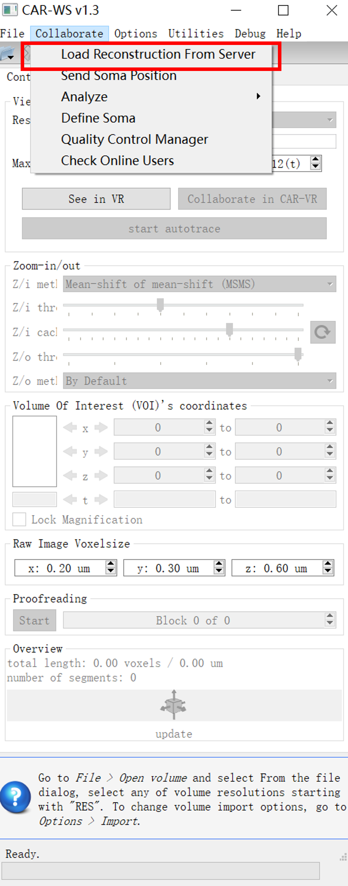
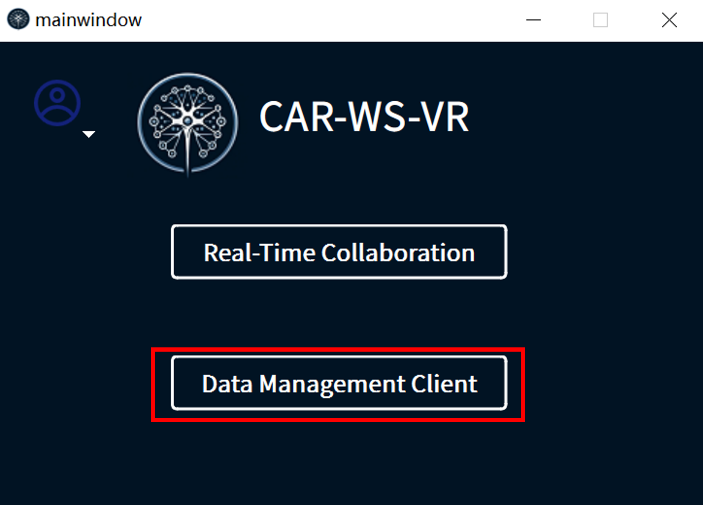
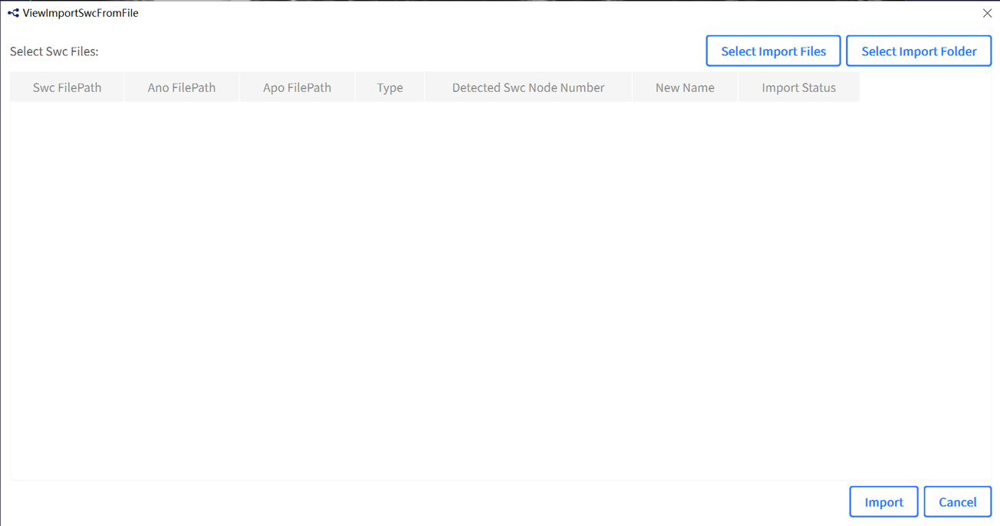
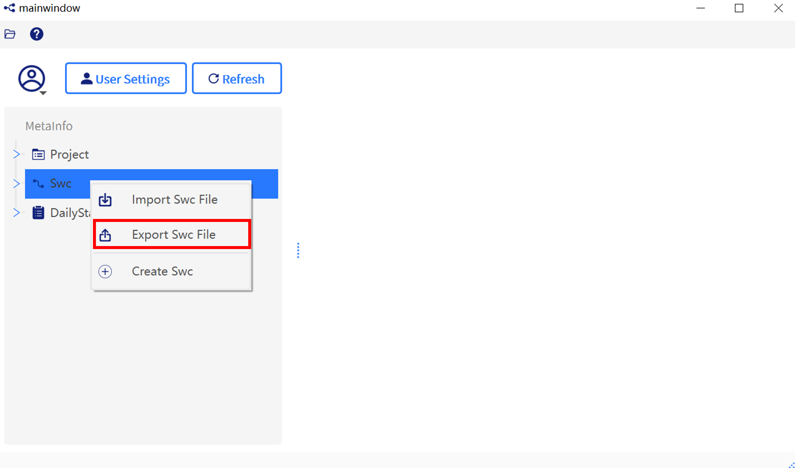
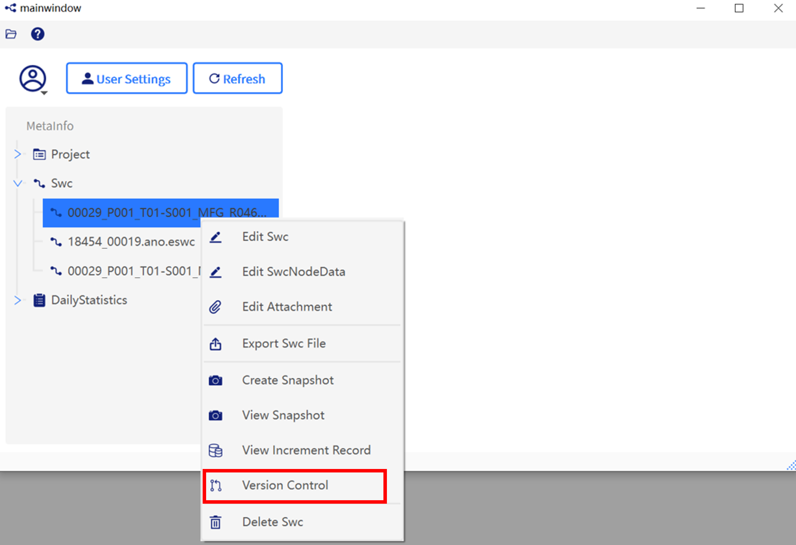

# CAR-WS

CAR-WS, which are built upon the foundation of the Vaa3D system, while incorporating a cloud server and enabling collaborative capabilities. And it also take several features from [Vaa3D](http://www.vaa3d.org/), refers the [User Manual](https://github.com/Vaa3D/Vaa3D_Wiki/wiki/UserManual.wiki) for details.

## Installation

The workstation client and the VR client share the same software. For Windows system user, please download and unzip the releases and click on `vaa3d_CAR.exe` to run the software. For others system user, please build CAR-VR-WS from scratch.

Build CAR-WS-VR from scratch

CAR-WS and CAR-VR clients share the same codebase based on Qt 4.7.3. You can refer to the following tutorials to compile.

- [On Linux](https://github.com/Vaa3D/Vaa3D_Wiki/wiki/Build-Vaa3D-on-Linux): Build CAR-VR-WS with MSVC and QMake.
- [On Windows](https://github.com/Vaa3D/Vaa3D_Wiki/wiki/Build-Vaa3D-on-Windows-(QMake)): Build CAR-VR-WS with LLVM and QMake.
- [On Mac](https://github.com/Vaa3D/Vaa3D_Wiki/wiki/Build-Vaa3D-on-Mac-OS): Build CAR-VR-WS with GCC and 

## Step-by-Step Guide

1. Enter the CAR collaborate mode, `Advanced` - `Big-Image-Data` - `CAR-WS`
    > 

    > 
Screenshots

    >
    > 
    > 

2. Configuration CAR
    1. Click `Collaborate` - `Config`;
    2. Enter the server configuration;
    3. Login to CAR by enter the username and password.
    > 

    > 
Screenshots

    >
    > 
    >
    > 
    > 

3. Open image and load annotation
    1. Click `File` - `Open TeraFly Image(3-5D)` and choose an image;
    2. Users can collaborate in one room each other by download the same ano file.
    > 

    > 
Screenshots

    >
    > 
    >
    > 
    > 

4. Collaborators can annotate by using short cuts

    - **Alt-B**: invoke the curve drawing function using serial BBoxes;

    - **Alt-C**: invoke the multiple neuron-segments Connection function;

    - **Alt-D**: invoke the multiple neuron-segments Deleting function;

    - **Alt-S**: invoke the multiple neuron-segments Splitting/breaking function.

      Auto reconstruction:

      

    ### How to use Data management system in CAR?

    1) Click `Collaborate` - `Data Management Client` and invoke the data management system;

       

       
Screenshots

       
       
       
       
    
    2. log into the data management system;
    
       

       
Screenshots

    
    
    
    3. Click on the "Import Swc File" button. In the pop-up window, select your morphology file and click "Import."
    
       

       
Screenshots

4. Export data

   Select the file, right-click, and choose "Export Swc File" from the context menu. After a new window pops up, select the destination path to save the file, then click 'Export' to export the file to the specified directory.
   
   

   
Screenshots

   
   

Screenshots

5. Version Control 

   1. Select the file, right-click, and choose "Version Control" from the context menu.
   
   

   
Screenshots

 2. A new window will appear, allowing the user to specify any timestamp for exporting or reverting to  

    the reconstructed morphology using the 'Export' and 'Revert' buttons. This feature enables tracing back to historical reconstruction data at any desired moment.

Screenshots

3. Select "Export," and a new window will appear. In this window, users can view specific features of the exported morphology, including Swc Node Number, and choose the save path for the exported file.

Screenshots

