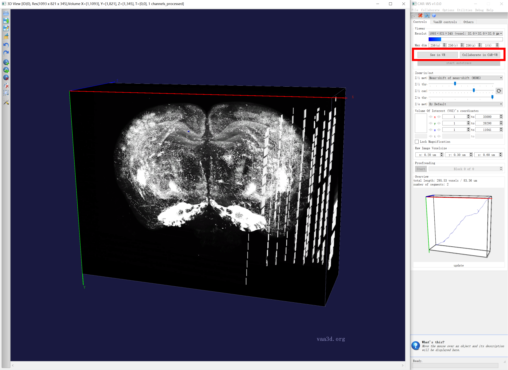
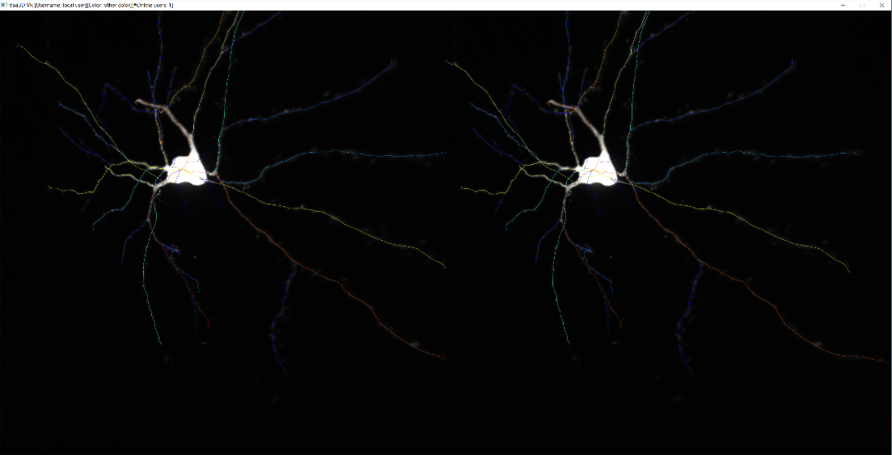
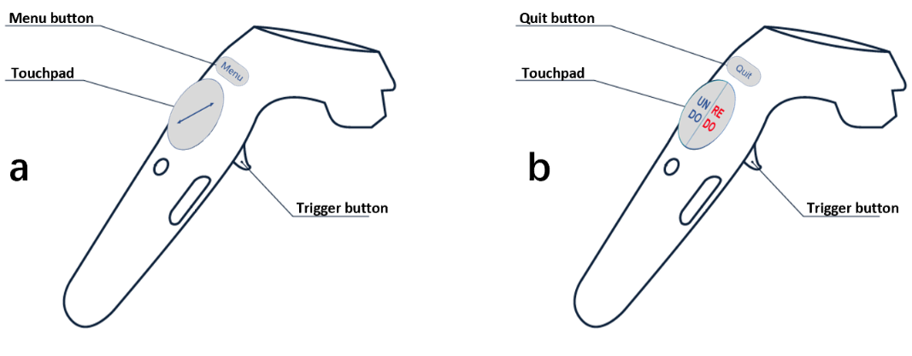
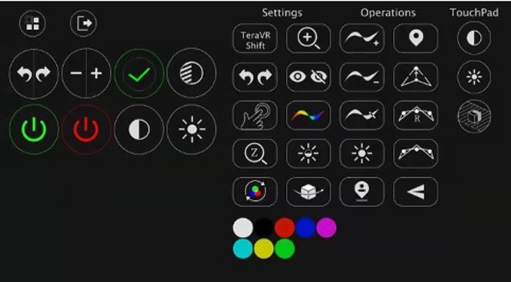

# CAR-VR

## Installation

CAR-VR and CAR-WS have the same installation steps since they share the same software. Please refer to [CAR-WS](./2-CAR-WS.md) instructions.

## Step-by-Step Guide

### Entering and exiting CAR-VR

First, the user needs to start the Vaa3D software, load an image volume, a surface object, or whole-brain data, power on the Vive device, and also launch the Steam VR software. Next, CAR-VR can be launched from a CAR-WS viewer of Vaa3D by clicking the "See in VR" button, as shown below. After that, the user can put on the VR headset to start using CAR-VR, and all the contents previously in the 3-D viewer are now observable in CAR-VR. Additionally, a companion window that replicates the view in the headset is displayed on the computer monitor, allowing other users to see what is currently being viewed in VR.

To exit CAR-VR, the user can either press the exit button on the setting controller or press the ESC button on the keyboard. After exiting, all the latest annotation results in CAR-VR are brought back to the 3-D viewer, where the user can continue to edit.

### User interactions in CAR-VR

User interactions in CAR-VR is mainly carried out with the two handheld controllers. These two controllers can be used either individually or simultaneously. Two corresponding virtual models of the controllers are shown in CAR-VR, which have synchronized locations with the physical devices. The annotation controller (AC) is mainly used for annotation purpose, and the setting controller (SC) is mainly used to adjust various settings. Each controller has a touchpad and a trigger button. Their functions will be described in detail in the following sections. Besides, AC has a Menu button, and SC has a Quit button. The menu button is used to activate/deactivate the menu for various CAR-VR functions and settings. When the menu button is pressed, the menu for major CAR-VR functions appears on top of SC. Pressing the menu button again will hide the menu. In order to select a menu item, the user aims the red-colored shooting ray from AC at the desired menu item, and presses the trigger button of AC.

### Visualization

CAR-VR is based on stereo visualization and provides an intuitive tool for observing 3-D imaging data and 3-D objects. In CAR-VR, real and virtual worlds are synchronized. When a user wearing the VR headset changes the viewing direction by turning the head or moving around, the contents being visualized are automatically updated according to the new viewing direction, which brings a very similar experience as the real world perception. Also, just like dealing with physical objects, the user can virtually hold 3-D imaging data and objects in hand and rotate around to adjust observation perspective. This can be done by holding the trigger button of SC and rotating the controller.

Current imaging techniques often generate anisotropic data, where the z resolution is not as high as the x and y resolutions. CAR-VR supports non-uniform scaling of imaging data, and the user can stretch the data in the z direction by touching the  button on the touchpad of AC. If the upper half of the button is touched, the z direction keeps scaling up; if the bottom half is touched, the z direction keeps scaling down.

CAR-VR supports hierarchical management and visualization of teravoxel-scale images. To zoom-in/zoom-out across different resolution levels, select the  button from the menu, and press the  button on SC accordingly. To shift to an adjacent image volume of the same resolution level, select the  button from the menu, place SC at a desired position, and press the  button on SC. Depending on the relative position between the SC and the center of the image volume, a corresponding adjacent image volume will be fetched and displayed. Refer to Supplementary Video 1 and 2 for further demonstration. There are also several settings and functions related to visualization, such as adjusting contrast.

### Annotation

CAR-VR provides various tools for 3-D neuron morphology annotation. With CAR-VR, the user works in a true 3-D environment and has full degrees of freedom while interacting with 3-D imaging data and objects. The user can precisely pinpoint a 3-D location in the virtual world in an intuitive way (e.g., by posing a controller to a desired location) and carry out various annotation tasks, such as tracing neurites, adding markers, modifying geometry, etc. This section describes the major annotation functions of CAR-VR.

#### Adding a neurite

To add a neurite, the user opens the menu, selects the "Curve +" icon for the "Add neurite" function, and closes the menu after that. Next, the user finds a suitable viewing perspective, aims at the desired neurite signal with the sphere on AC, and traces the neurite by moving the sphere along it while holding the trigger button of AC. Refer to Supplementary Video 3 for further demonstration of adding neurites.

CAR-VR provides two modes for tracing a neurite, i.e. the virtual finger (VF) mode and the non-virtual finger (non-VF) mode. With the VF mode, the drawn segment will automatically align with the signal in the imaging data to achieve high accuracy and consistency in tracing. With the non-VF mode, CAR-VR will generate a free-form curve that strictly follow the moving path of AC. In general, we can use the VF mode to trace relatively strong signals and use the non-VF mode to trace extremely weak signals.

When the newly traced neurite is close enough to an existing one, CAR-VR will automatically attach them together to form a connected neuronal tree. To differentiate structures that have different biological meanings, the user can assign different colors to each curve and marker. If the white color is used, the current neurite will adopt the color of the neurite which it connects to. For settings of the virtual finger mode and the tracing color, refer to Section 1.5 for instructions.

#### Deleting a neurite

To delete a neurite, the user selects the "Curve -" icon in the menu. After the function is selected, the user moves AC near a neurite to be deleted and presses the trigger once. CAR-VR will find a nearest neurite around the AC and delete it. If there is no nearby neurite, none will be deleted. Refer to Supplementary Video 4 for further demonstration.

#### Adding a marker

Sometime the user needs to put markers at specify locations of interest. To do that in CAR-VR, the user selects the "Location +" icon in the menu. Then, the user moves AC to the location of interest, aims with the sphere on AC, and presses trigger once. A marker can thus be added at that location in the currently chosen color. Refer to Supplementary Video 5 for further demonstration. To change color for adding markers, refer to Section 1.5.4.

#### Deleting a marker

To delete a marker, the user selects the "Location -" icon in the menu. Then, aim at the marker to be deleted with the sphere on AC, and press trigger once. Refer to Supplementary Video 5 for further demonstration.

#### Dragging a node on a neurite

Sometime, the user would like to fine tune the geometry of an existing neurite, in order to further improve the precision of reconstruction. CAR-VR provides the node dragging function that allows one to modify the location of individual nodes on neurites. To do that, the user selects the "Dragging" icon in the menu. After the function is selected, the user reaches a local region of a neurite with AC and holds the trigger button. A node on this neurite is thus locked by the AC. Then, without releasing the trigger, the user moves the node to a desired location and releases the trigger. The geometry of the neurite will then be modified accordingly. Refer to Supplementary Video 6 for further demonstration.

#### Splitting a neurite

To split a neurite into two smaller ones, the user selects the "Curve" icon in the menu. Next, the user aims at the location to be split on the neurite with the sphere on AC and presses the trigger once. After that, the original neurite is broken into two neurites. The user can continue to edit these new smaller neurites, e.g. deleting one of them. Refer to Supplementary Video 6 for further demonstration.

#### Subdividing a neurite

Sometime, the number of nodes of a neurite is too few to precisely represent the exact signal in the imaging data. In such cases, the user can use the subdivision function to add more nodes to a neurite to increase its representation capability. First, select the "Curve and Line" icon in the menu. Then, use the sphere on AC to aim at the neurite where more nodes are desired. Next, press the trigger once. As a result, the subdivided neurite will now have more nodes which allows the user to modify the geometry in detail. Normally, there would be slight deformation on the neurite to indicated that the subdivision succeeded. Refer to Supplementary Video 6 for further demonstration.

### Collaboration mode

Reconstructing full morphology of neurons is a challenging task, and a collaboration mechanism can be helpful for both neuron reconstruction and proofreading. The collaboration mode of CAR-VR allows multiple users to work collaboratively on a same piece of data. These users can work together in a same workspace or be located worldwide.

To use the collaboration mode, first a cloud-based server needs to be launched to perform user management, synchronize reconstruction data, and coordinate actions among multiple users. 

The collaboration mode of CAR-VR can be initiated both from normal 3-D viewers for regular image data and from CAR-WS 3-D viewers for whole-brain image data. Take the latter case here as an example. In the CAR-WS, the user clicks the "Collaborate in VR" button, and will be prompted to input server address, server port, and login name (Figure 6). After entering the above information, it will connect to the collaboration server, and start CAR-VR with collaboration. Any other users that are working on the same whole-brain imaging data can join the collaboration with the same procedure. The number of users currently in collaboration is displayed on the title of the companion window.

In the collaboration mode of CAR-VR, an avatar for each user that represents the user’s instant position is displayed, and its position is updated when the user moves. Therefore, a user is aware of where other people are working at. Also, each user is assigned with a unique color, which is used for both the avatar and the reconstructions done by the user.

Basically, annotation operations in collaboration mode do not differ too much with those in standalone mode. Only that during collaboration, reconstruction results are shared in real-time among all the collaborators. This means users not only generate reconstructions on their own, but can also edit the reconstructions created by others as well, e.g. deleting a neurite, changing the local geometry of a neurite, etc. Moreover, the collaboration is flexible in that users can even work at different regions of the whole-brain imaging data at different level-of-details.

### Settings and tools

This section describes several settings and tools in CAR-VR to facilitate neuron reconstruction. Most of the settings will be remembered even the user temporarily quits from CAR-VR.

#### Undo / Redo

CAR-VR supports undo and redo operations during neuron reconstruction. First, the user selects the "Undo/Redo" icon, and the "Undo/Redo" button appears on the touchpad of SC. To undo a previous operation, the user presses on the left half of the "Undo/Redo" button; similarly, to redo a revoked operation, the user presses on the right half of the "Undo/Redo" button. CAR-VR supports 5 levels of undo and redo. Refer to Supplementary Video 4 for further demonstration.

#### Adjusting contrast

During neuron reconstruction, the strength of signal varies across the neuronal image, and the user usually needs to adjust the contrast of image from time to time, in order to have the best observation of the signal. In CAR-VR, the user can first select the "Contrast" icon, and then use the "Contrast" button on the touchpad of SC to adjust contrast. Press left half of the button to decrease contrast level and the right half to increase contrast level. Press the button one or more times to obtain the ideal effect. Refer to Supplementary Video 7 for further demonstration.

#### Showing or hiding the annotation

In CAR-VR, a user can choose to temporarily hide the annotation in order to inspect the imaging data more clearly, and to show the annotation again later to continue the reconstruction. To do that, the user selects the "Show/Hide" icon from the menu, and presses the "ON" or "OFF" button on the touchpad of SC to toggle the show/hide status. Refer to Supplementary Video 8 for further demonstration.

#### Changing the color for tracing

The color for tracing is indicated by the sphere on AC. To change the tracing color, open the menu and select the "Change Color" icon. As a result, an "OK" button will appear on the touchpad of SC. While the user presses the "OK" button, the tracing color will be switched among a set of colors. Once a color is set, all the neurites and markers added later will adopt that color. Refer to Supplementary Video 9 for further demonstration.

#### Toggling the virtual finger mode

To toggle between virtual finger mode and non-virtual finger mode, the user opens the menu can select the "Virtual Figure" icon. Then, there will be a  or  button on the touchpad to indicate the status of the VF mode. Press the touchpad to toggle the VF mode. Refer to Supplementary Video 3 for further demonstration.

#### Brightness suppression

Neuronal imaging data might have uneven distribution of signal strength even in a local region which could cause difficulties for reconstruction. For example, while the dendrites are relatively bright, the axonal neurites around soma area can be quite dim and thus difficult to observe even after adjusting contrast. CAR-VR has the brightness suppression function, which can be used to suppress the bright signals and make the dim structure easier to observe. To do that, the user selects the "Brightness Supression" icon from the menu, and presses the "OFF" or "ON" button on the touchpad of SC to enable or disable it. Refer to Supplementary Video 7 for further demonstration.

#### Switching channels of an image

CAR-VR can be used for the visualization of both single-channel and multi-channel imaging data. For multi-channel data, CAR-VR lets the user show all the channels simultaneously, or switch among individual channels. To switch channels, the user selects the "-/+" icon from the menu, and a  button will appear on the touchpad of SC. Press either "-" or "+" to switch among red/green/blue/all channels, in a forward or backward order.

#### Automatic rotation

For 3-D imaging data, sometimes inspecting data from various angles is preferred in order to accurately understand the underlying structure. In CAR-VR, the user can select the "Auto Rotation" icon from the menu for the automatic rotation of 3-D data. To enable automatic rotation, the user presses the "ON" button on the touchpad of SC. Then, the data will start to rotate automatically using the position of SC as the rotation origin. The user can press the "OFF" button to stop it. Refer to Supplementary Video 11 for further demonstration.
