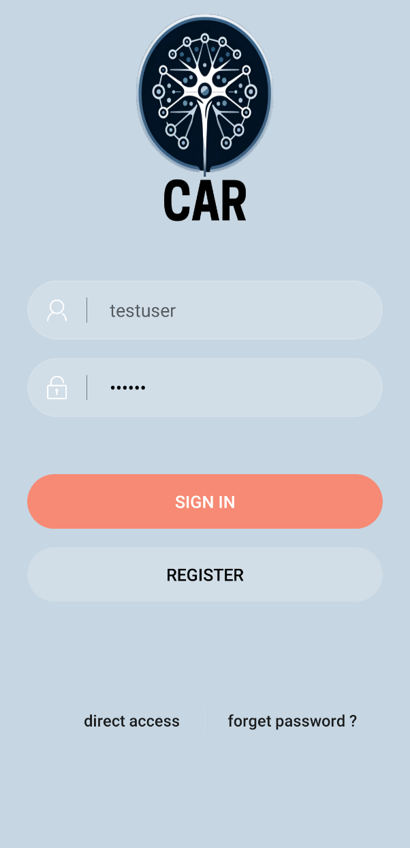
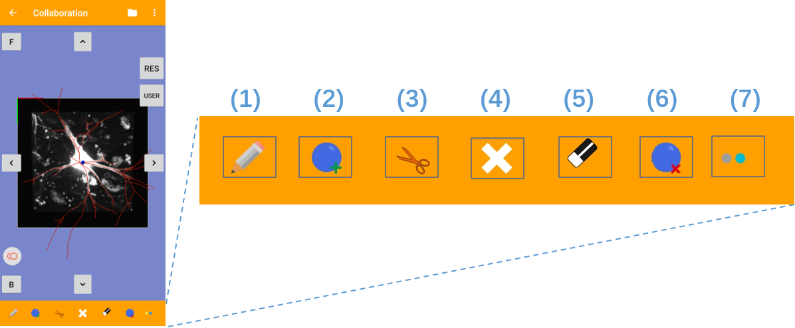
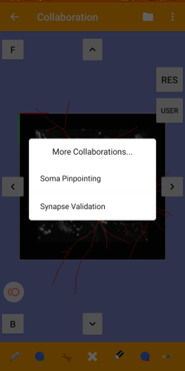

# CAR Mobile

CAR-Mobileis a tool developed for the Android system to allow visualization and assisted analysis of multi-dimensional images. The tool has been implemented in Java with OpenGL.

This supplement describes common use cases for CAR and the CAR software itself, including installation, user interface, and available functionalities. Since CAR is under ongoing development, this supplement may not include the most recent updates, or it could reflect slightly different names for the various functionalities available.

# Installation

Currently we provide only the binary for Android phones. Download the binary release, install it on your Android phone and it's ready to go. If you need iPhone version, you are encouraged to contact the developers to get an alpha version for testing.

# Step-by-Step Guide

## Register and Login

To use CAR_Mobile, you will need to register or sign in if you already have an account. The process is as follows:

1. Open the software application to access the login interface.
2. In the login interface, you will find an input box for entering your account and password.
3. Enter your account and password into the respective input boxes.
4. Next, click on the “Sign In” button to proceed with the login process.
5. If you don’t have an account and would like to register a new one, click on the “Register” button. This action will direct you to the register interface where you can create a new account.
6. If you prefer to explore the software as a guest without registering, you can click on the “Direct Access” button. However, please note that some functions may be limited in the guest mode.

The user interface of login activity.

The register interface. Users need to enter various information for the new account. The input fields with a red star must be filled in. Password need to be entered twice to confirm. If the username does not already exist, a new account will be created.

## Collaboration

Upon logging in, you'll seamlessly enter Collaboration Mode. Within this mode, you can explore the mouse brain by toggling between various resolutions of brain images. Additionally, you have the flexibility to navigate the images along the X-axis, Y-axis, and Z-axis to gain a comprehensive perspective. Furthermore, Collaboration Mode allows you to engage with other users and collaborate across different client platforms, such as CAR-Workstations and CAR-VR. Simply enter the same collaboration room and select the identical anomaly (.ano) file—a morphometry file format defined in Vaa3D, encompassing SWC file information and Apo file information—to begin collaborative efforts

Please follow the instructions below to use collaboration mode:

1. Within the Collaboration Mode interface, locate and click on the “Open File” button.
3. This action will trigger a dialog box named “File Open” to appear.
4. In the “File Open” dialog box, select the option “Open BigData”.
5. Another dialog box named “Ano Number” will appear, in the “Ano Number” dialog box, choose the specific anomaly (.ano) you want to reconstruct.
6. Once you have selected the anomaly, the corresponding ano file and its corresponding image file will be presented.

Buttons (3-4, 6-7, 10-11) to move the image block:
These buttons allow users to move the image block in different directions: up, left, right, down, forward, and backward.
Button (8) to show the resolution list:
This button displays the resolution list, allowing users to switch between different resolutions.
Button (5) to zoom in:
Users can zoom in to a higher resolution by circling the area of interest using this button.
Button (9) to show the online collaboration list:
This button reveals the list of users currently collaborating online.
Additionally, whenever there is a new user entering or exiting the collaboration session, a toast message will appear to notify users.

The expanded bottom menu.
(1) is the button to draw curve. 
(2) is the button to pinpoint. 
(3) is the button to split line. 
(4) is the button to fold up menu. 
(5) is the button to erase curves. 
(6) is the button to delete marker. 
(7) is the button to expand the menu for more annotation methods.

All operations can be activated by pressing once, and the pressing again will exit the current operation. For example, press the draw curve button once, and users can draw curves by swiping finger across the screen. Press again to quit. All operations described below need to be performed after activating the corresponding mode. Pinpoint means to click the desired position to generate a marker in the corresponding area. Delete curves by swiping finger to intersect with the target ones. Click the target marker to delete it. Selecting the curve and marker to change the color is similar to the delete operation. Split means to split a curve into two by swiping to intersect the curve at the point you want to split. 

The expanded bottom menu.

1. the button to change curve color;
2. the button to change marker color. 

All operations that move an image block will download a new image block with the corresponding coordinates at the same resolution. When switching resolutions with this list, a different resolution image block is downloaded with the same center position. After clicking (4), circle the area of interest and it will zoom in to higher resolution with this area in the center of new block. 

## Other Collaborations

If you wish to utilize other collaborative functionalities, such as soma annotation and Bouton data inspection, you can access these through the Collaboration Mode settings. Clicking on the settings icon will prompt a dialog box as shown in the following image. From there, you can select to enter either the 'Soma Pinpointing' mode or the 'Synapse Validation' mode.

### Soma-pinpointing

UI of Soma pinpointing.

1. Back: back to home page.
2. Score: user’s operation score
3. Viewport: visualize and interact with image block:
    - Rotation: use one/two (two fingers move in parallel) finger(s) swap across the screen and image block rotate towards desired direction on default mode/annotation mode.
    - Zoom: use two fingers zoom in/out, the scale of image will go with distance between two fingers.
    - Annotation: annotate on image in certain annotation mode.
4. Open file: open a new file and the preloading will start, eight files will be cached.
5. Settings: settings panel have six items, five of them are introduced above.
6. Auto upload: switch of auto upload, annotations will be uploaded when change to another image if the switch is on.

File opened UI of Marker Factory.

1. undo/redo: undo or redo the annotation operations.
2. submit annotation: submit current annotations to server.
3. open file: add a new file to the end of file queue and open the new file.
4. share screenshot: capture current screen and user can choose a way to share it.
5. block information: the format of file information is brainId_x_y_z.
6. previous file: switch to previous file.
7. contrast: adjust contrast of current image to have a better observation.
8. boring file: if there is no soma in current image, the image should be labeled as a boring file.
9. good file: if the current image is in good quality, the image can be labeled as a good image.
10. already checked: there is no more unannotated soma in current file, the file should be labeled already checked.
11. add/delete somas (marker denoted): enter or exit add/delete somas mode, including add marker mode and delete marker mode. 
12. next file: switch to next file.

When you first enter Marker Factory mode, press to initialize the file queue and open a new file. 8 files will be preloaded locally and current file is the first one.

There three types of file in marker factory mode:
1. the file with unannotated soma.
    When users finish their annotation, they can submit them in two ways:
    - Submit them manually by press icon.
    - Submit them automatically (by open auto upload option in settings options) when switching file.
2. the file doesn’t contain any soma. Press :wastebasket: to label current file as a boring file and only deleting operations will be applied.
3. the file doesn’t contain any unannotated soma. Press :white_check_mark: to label current file as a checked file.
Once users do any of above operations, current file will be labeled as checked file on the server and will not be delivered to any user. Otherwise, user may load the same file again in the future.

### Synapse Validation

File opened UI of Synapse validation.

1. undo/redo: undo or redo the annotation operations.
2. submit annotation: this function was used to submit annotation.
3. open file: add a new file to the end of file queue and open the new file.
4. share screenshot: capture current screen and user can choose a way to share it.
5. block information: the format of file information is brainId_x_y_z.
6. previous file: switch to previous file.
7. contrast: adjust contrast of current image to have a better observation.
8. Hide /Show swc: you can press down or up this button to show annotation files (markers and lines) or hide annotation files.
9. Delete boutons (markers): delete boutons (markers) that are not real boutons.
10. already checked: there is no more unannotated soma in current file, the file should be labeled already checked.
11. annotation mode: enter or exit annotation mode, including add marker mode and delete marker mode.
12. next file: switch to next file.
