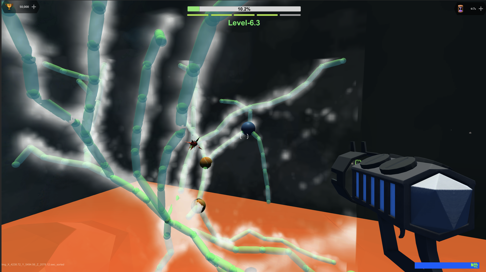

# CAR-Game

CAR-Game is a separate component of the CAR ecosystem and also utilizes the CAR Server for task distribution and scheduling. It is designed to enable the general public to understand and explore neuronal data, but it is not a major part of the work titled "Collaborative Augmented Reconstruction for Scaled Production of 3D Neuron Morphology in Mouse and Human Brains" and remains unpublished. The user manual for CAR-Game is yet to be developed.

